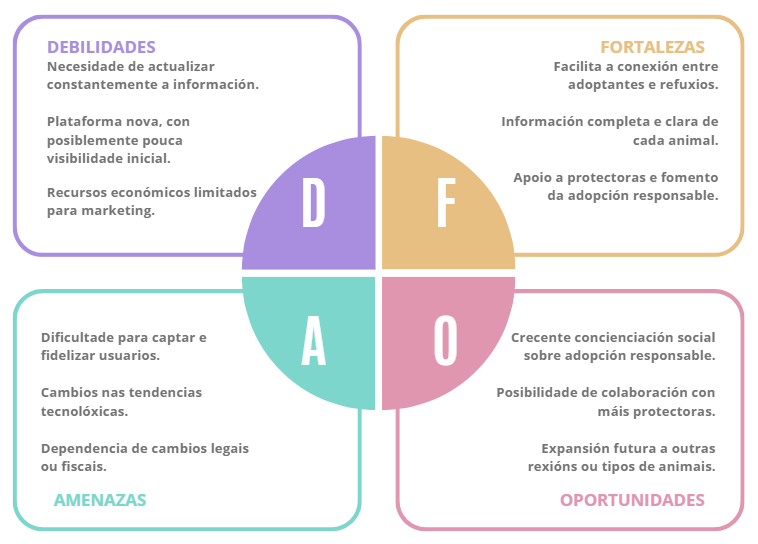

# 1- Empresa

- [1- Empresa](#1--empresa)
  - [1.1- Idea de negocio](#11--idea-de-negocio)
  - [1.2- Xustificación da idea](#12--xustificación-da-idea)
  - [1.3- Segmento de clientes](#13--segmento-de-clientes)
  - [1.4- Competencia](#14--competencia)
  - [1.5- Proposta de valor](#15--proposta-de-valor)
  - [1.6- Forma xurídica](#16--forma-xurídica)
  - [1.7- Investimentos](#17--investimentos)
    - [1.7.1- Custos](#171--custos)
      - [Custos fixos](#custos-fixos)
      - [Custos variables](#custos-variables)
      - [Impostos e custos sociais](#impostos-e-custos-sociais)
    - [1.7.2- Ingresos](#172--ingresos)
  - [1.8- Viabilidade](#18--viabilidade)
    - [1.8.1- Viabilidade técnica](#181--viabilidade-técnica)
    - [1.8.2 - Viabilidade económica](#182---viabilidade-económica)
    - [1.8.3- Conclusión](#183--conclusión)

## 1.1- Idea de negocio

O produto central do proxecto é unha aplicación e páxina web destinada á adopción de animais de compañía. Esta plataforma funcionará como un punto de encontro entre persoas interesadas en adoptar e protectoras ou refuxios que teñen animais que necesitan un fogar. A través dela, os usuarios poderán consultar fichas detalladas dos animais dispoñibles para adopción, coñecer as súas características e iniciar o proceso de contacto cos responsables do refuxio.

O valor engadido da aplicación reside en que **centraliza nun único espazo a información de diferentes refuxios e protectoras, facilitando o acceso aos animais en adopción**. Ademais, ofrece unha **presentación clara e organizada de cada animal** (idade, raza, tamaño, carácter, necesidades, etc.), o que axuda aos usuarios a tomar decisións responsables. Tamén incorpora **formularios de solicitude e contacto directo**, simplificando a comunicación entre os adoptantes e as organizacións responsables.

A utilidade principal desta plataforma é **facilitar e fomentar a adopción responsable de animais, reducindo o abandono e mellorando a visibilidade do traballo das protectoras**. Ao mesmo tempo, permite ás persoas atopar con maior facilidade unha mascota que se adapte ao seu estilo de vida, facendo que o proceso de adopción sexa máis accesible, rápido e organizado grazas ás ferramentas dixitais

## 1.2- Xustificación da idea

A idea deste proxecto xorde da necesidade de **facilitar o proceso de adopción de animais de compañía e de mellorar a visibilidade dos animais que se atopan en refuxios e protectoras**. Na actualidade, moitos animais son abandonados cada ano e os refuxios teñen dificultades para darlles difusión e atopar persoas dispostas a adoptalos. Ao mesmo tempo, moitas persoas interesadas en adoptar non saben onde buscar información fiable nin como contactar facilmente coas organizacións responsables.

A necesidade principal que se pretende cubrir é a de **dispoñer dun espazo centralizado onde consultar animais en adopción, con información clara e actualizada**. Ademais, tamén se busca cubrir a necesidade de mellorar a comunicación entre adoptantes e refuxios, xa que en moitos casos esta comunicación realízase a través de redes sociais ou páxinas pouco estruturadas.

Na actualidade existen algunhas páxinas web e aplicacións que permiten buscar animais para adoptar, pero moitas delas presentan limitacións, como información incompleta, pouca actualización dos datos ou falta de conexión directa cos refuxios. En moitos casos, cada protectora utiliza as súas propias redes sociais ou páxinas web, o que fai que a información estea dispersa e resulte máis difícil para os usuarios atopar o animal adecuado.

Por este motivo, pódese considerar que o mercado non está totalmente desabastecido, pero si **insuficientemente atendido**, xa que **non sempre existen plataformas sinxelas, claras e centralizadas que faciliten todo o proceso de adopción nun único lugar**. O proxecto pretende mellorar esta situación ofrecendo unha ferramenta máis organizada, accesible e pensada tanto para os adoptantes como para as protectoras.

**Gráfico DAFO:**

## 1.3- Segmento de clientes

Este proxecto está dirixido principalmente a **persoas ou familias interesadas en adoptar animais de compañía**, así como a **refuxios e protectoras de animais que necesitan dar visibilidade aos animais que teñen en adopción**.

En primeiro lugar, un dos segmentos principais son particulares ou familias que desexan adoptar unha mascota, especialmente **adultos novos, persoas maiores e familias que buscan un animal de compañía**. Xeralmente trátase de persoas que utilizan internet e dispositivos móbiles para buscar información e que valoran poder comparar opcións e obter datos claros antes de tomar unha decisión.

Outro segmento importante son as **protectoras e refuxios de animais**. Estas organizacións necesitan **canles eficaces para mostrar os animais que teñen ao seu cargo e facilitar o contacto con posibles adoptantes**. A plataforma permitiralles publicar información sobre os animais, actualizar os seus datos e recibir solicitudes de adopción de maneira organizada.

## 1.4- Competencia

A competencia de maior relevancia é sen dúbida **Miwuki Pet Shelter**, unha aplicación e páxina web que permite ás protectoras publicar animais en adopción e aos usuarios buscar mascotas segundo diferentes criterios (especie, tamaño, localización, etc.). Ao igual que a idea do noso proxecto, reúne animais procedentes de protectoras e asociacións de distintos lugares e actúa como intermediaria no proceso de contacto entre adoptantes e organizacións.

Outra plataforma relevante é **MundoAnimalia**, un portal especializado en mascotas que permite publicar anuncios relacionados con animais, incluíndo adopcións e compra-venda. Funciona como un mercado en liña no que particulares e profesionais poden publicar anuncios, xa sexa de forma gratuíta e con opcións de pago para maior visibilidade.

Tamén existen iniciativas impulsadas por empresas do sector das mascotas, como **Kiwoko Adopta**, unha plataforma creada pola empresa **Kiwoko** que colabora con protectoras para promover a adopción de cans e gatos, ademais de servizos substitutivos que tamén inflúen no mercado, como páxinas web e redes sociais das propias protectoras.

Sen embargo, en canto á cota de negocio, **non existe un único líder absoluto**, xa que **o sector está moi fragmentado**. Moitas adopcións realízanse directamente a través das páxinas web das protectoras, redes sociais ou plataformas especializadas. Isto fai que o mercado estea repartido entre varias webs e organizacións, sen que unha única plataforma concentre a maioría das adopcións.

## 1.5- Proposta de valor

En comparación con outros servizos existentes, esta aplicación diferénciase por **centrarse exclusivamente na adopción responsable**, evitando a mestura con anuncios de compra e venda de animais que aparece noutras plataformas. Isto permite crear un espazo máis **enfocado na protección animal e no benestar das mascotas**.

Entre as melloras fronte aos competidores destaca tamén a **centralización da información de diferentes refuxios nun único lugar**, evitando que os usuarios teñan que visitar múltiples páxinas web ou redes sociais para buscar animais en adopción, e tamén **maior variedade de refuxios e protectoras**, repartidas por todo o país e podendo obter un listado de ditas protectoras filtrada por diferentes apartados, como cantidade de refuxios ou maior proximididade á localización exacta dos usuarios.

O valor que aporta ao mercado é principalmente **facilitar e fomentar a adopción responsable**, aumentando a visibilidade dos animais que necesitan un fogar e apoiando o traballo das protectoras. Ao mesmo tempo, contribúe a **reducir o abandono animal ao promover decisións máis informadas antes de adoptar**.

As persoas utilizarán esta plataforma fronte a outras opcións porque ofrece un **proceso máis sinxelo, organizado e fiable**, no que poden atopar información clara sobre os animais e contactar directamente coas organizacións responsables.

## 1.6- Forma xurídica

Tras estudalo, a forma xurídica escollida para iniciar o noso negocio será a Sociedad Limitada ou de Responsabilidad Limitada,
polos seguintes motivos:

- Responsabilidad dos socios polas deudas sociais está limitada ás aportacins de capital e non ao patrimonio persoal.
- Capital mínimo para a súa constitución moi reducido e sin capital máximo (mínimo de 3000 €).
- Número mínimo de socios 1 e sen límite.
- Posibilidad de aportar o capital en propiedade ou diñeiro.
- Reforza a percepción das empresas afiliadas, dando unha imaxe mais profesional.

## 1.7- Investimentos

- Portátiles para o desenvolvemento e xestión da plataforma (4 equipos): aproximadamente 550 € cada un → 2.200 €
- Ratos (4 unidades): 10 € cada un → 40 €
- Teclados (4 unidades): 25 € cada un → 100 €
- Auriculares (4 unidades): 30 € cada un → 120 €
- Webcams (4 unidades): 35 € cada unha → 140 €
- Sillas de traballo (4 unidades): 120 € cada unha → 480 €
- Escritorios (4 unidades): 150 € cada un → 600 € 
- Ferramentas de desenvolvemento ou software necesario: 200 €
- Deseño de logotipo e identidade visual: 150 €
- Deseño da interface da aplicación e da web: 300 €
- Gastos administrativos e posibles rexistros: 100 €
- Fondo para imprevistos: 200 €

Total estimado do investimento inicial: **aproximadamente 4.630 €**

### 1.7.1- Custos

#### Custos fixos
- Custo das oficinas de traballo: 3.000 € / ano
- Hosting e servidor web: 100 € / ano
- Dominio web: 15 € / ano
- Servizos de almacenamento e base de datos na nube: 150 € / ano
- Mantemento técnico da web e da aplicación: 500 € / ano
- Publicidade básica e promoción en internet: 300 € / ano
- Software e ferramentas dixitais: 200 € / ano
- Servizos de seguridade e copias de seguridade: 100 € ao ano
  
Total custos fixos aproximados: **4.365 € por ano**

#### Custos variables
- Campañas adicionais de publicidade ou promoción: 200 – 500 € / ano
- Ampliación de capacidade do servidor se aumenta o número de usuarios: 100 – 300 € / ano
- Actualizacións e melloras da aplicación: 200 – 400 € / ano
  
Total estimado de custos variables: **entre 500 € e 1.200 € por ano**

#### Impostos e custos sociais
Se o proxecto xera ingresos e se establece como actividade económica, deberán considerarse:
1. IVE (Imposto sobre o Valor Engadido) aplicado aos servizos ofrecidos.
Supoñendo que os servizos premium para protectoras son de 15 € ao mes por cada unha, con 10 protectoras:
- _Ingreso mensual_: 20 € × 10 = 200 €
- _Ingreso anual_: 200 € × 12 meses = 2.400 €
- IVE do **21%** aplicado aos ingresos facturados a clientes (non subvencións nen ingresos non suxeitos): 2.400 € × 21% ≈ **504 € por ano**
2. IRPF (Imposto de Sociedades) dependendo da forma legal do proxecto.
Supoñendo que os ingresos o primer ano sería nde aproximadamente 3.900 €, e os custos fixos e variables serían de aproximadamente 2.215 €, o IRPF sería:
- _Beneficio neto_: 3.900 − 2.215 = 1.685 € de beneficio neto aproximadamente
- _IRPF_ = 1.685 x 25% ≈ **421.25 € aproximadamente**
3. Cotizacións á Seguridade Social.
Contando con que a empresa, nun inicio, estará formada por 2 socios cofundadores e 4 traballadores mais:
- _Socios cofundadores_: autónomos societarios, aproximadamente 320 €/mes cada un → 320 € × 12 × 2 = 7.680 € por ano
- _Traballadores_: Aproximadamente 1.200 € por ano: 1.200 € x 4 = 4.800 € por ano
- _Total cotizacións á Seguridade Social_: 7.680 € + 4.800 € = **12.480€ por ano**

### 1.7.2- Ingresos

**Política de prezos**

A plataforma ofrecerá un modelo freemium, no que exista unha versión básica gratuíta e servizos adicionais de pago.
- Publicación básica de animais para refuxios: gratuita
- Plan premium para protectoras (maior visibilidade, máis ferramentas): aproximadamente 15 – 25 € ao mes
- Publicidade de empresas relacionadas co mundo animal (clínicas veterinarias, tendas de mascotas, etc.): 50 – 100 € por campaña

**Previsión de ingresos**

Cunha estimación inicial:
- 15 protectoras cun plan premium de aproximadamente 20 € ao mes → 300 € ao mes
- Ingresos por publicidade ocasional → aproximadamente 300 € ao ano

Total ingresos aproximados: **3.900 € por ano**

## 1.8- Viabilidade

### 1.8.1- Viabilidade técnica

O proxecto é viable dende o punto de vista técnico, tendo en conta:
- **Recursos humanos**: Contamos cun equipo inicial formado por 2 socios cofundadores, encargados da xestión e coordinación, e 4 traballadores especializados (2 backend e 2 frontend), suficientes para desenvolver e manter a aplicación e páxina web.
- **Medios de produción**: Os recursos necesarios inclúen ordenadores, periféricos, mobiliario, servidores, software e ferramentas de desenvolvemento. Todos estes recursos son accesibles e non presentan limitacións técnicas para a posta en marcha do proxecto.
- **Materias primas e instalacións**: Non existen materias primas complexas. A infraestrutura céntrase en hardware, software e conectividade a internet. As instalacións requiridas son oficinas cun custo aproximado de 250 € ao mes, perfectamente asumible.
- **Impedimentos técnicos**: Non se identifican barreiras técnicas significativas. O desenvolvemento dunha aplicación web e móvil cunha base de datos para xestionar animais en adopción é tecnicamente alcanzable cos recursos humanos e materiais dispoñibles.

### 1.8.2 - Viabilidade económica
A viabilidade económica baséase nos investimentos, custos e ingresos estimados:
- _Investimento inicial_: aproximadamente 5.535 € (ordenadores, periféricos, mobiliario, software, deseño, publicidade e fondo para imprevistos).
- _Custos fixos anuais_: aproximadamente 1.265 €
- _Custos variables anuais_: entre 500 € e 1.200 €
- _Custos fiscais e sociais_: aproximadamente 13.109 € (cotizacións de socios e empregados, IVE, Imposto sobre Sociedades)
- _Ingresos anuais estimados_: 3.900 € (plans premium e publicidade)
  
Análise:
- O investimento inicial permite iniciar a actividade con todos os recursos necesarios.
- Os ingresos actuais non cubren completamente os custos sociais e fiscais se se contan todos os empregados e cotizacións de socios, pero poderían complementarse con financiamento adicional, subvencións ou aumento de clientes.
- A medida que a plataforma aumente o número de protectoras ou inclúa servizos adicionais, os ingresos crecerán, mellorando a viabilidade económica a medio prazo.

### 1.8.3- Conclusión

- _Viabilidade_: O proxecto é viable, tanto técnica como economicamente, cunha **planificación adecuada** e a posibilidade de **cubrir déficits iniciais mediante financiamento ou subvencións**.

- _Beneficios vs custos_: No primeiro ano, os beneficios poden ser baixos ou negativos se se consideran todos os custos sociais, pero a inversión inicial e os ingresos estimados permiten cubrir os custos operativos básicos. A longo prazo, co aumento de clientes ou adopcións premium, os beneficios poderán superar os custos.

- _Cobertura de perdas_: Eventuais perdas iniciais poderían cubrirse a través de **subvencións, programas de apoio á innovación ou financiamento público**, garantindo a continuidade da plataforma ata acadar un equilibrio económico.

[**<-Anterior**](../../README.md)
